# Jmeter + JavaFaker 自定义开发函数助手对话框

## Jmeter概述

Apache JMeter是Apache组织开发的基于Java的压力测试工具，用于对软件进行压力测试。JMeter最初被设计用于Web应用测试，但后来扩展到了其他测试领域，可用于测试静态和动态资源，如静态文件、Java小服务程序、CGI脚本、Java对象、数据库和FTP服务器等。

JMeter可以对服务器、网络或对象模拟巨大的负载，在不同压力类别下测试它们的强度和分析整体性能。另外，JMeter能够对应用程序进行功能/回归测试，通过创建带有断言的脚本来验证程序是否返回了期望结果。为了最大限度的灵活性，JMeter允许使用正则表达式创建断言。

**因此，Jmeter也常用来做接口测试。**

在设计阶段，JMeter能充当HTTP PROXY（代理）来记录IE/NETSCAPE的HTTP请求，也可以记录apache等WebServer的log文件来重现HTTP流量。此外，JMeter还支持缓存和离线分析/回放测试结果。

## JavaFaker概述

JavaFaker是一个用于生成假数据的Java库，可以帮助开发者快速生成模拟数据，以便进行测试、开发或演示。它提供了许多方法来生成各种类型的数据，例如姓名、地址、电话号码、电子邮件地址等。

使用JavaFaker，您可以根据需要生成大量的假数据，并且可以自定义生成的格式和规则。这对于在开发过程中模拟数据库或API响应非常有用。

要使用JavaFaker，您需要添加相应的依赖项到您的项目中，然后使用Java代码来调用JavaFaker类和方法生成假数据。生成的假数据可以用于测试、演示或开发应用程序。

总的来说，JavaFaker是一个方便的Java库，可以帮助开发者快速生成假数据。

## Jmeter + JavaFaker 自定义Jmeter函数助手对话框函数

我们都知道，Jmeter提供了丰富的函数助手对话框，在函数助手对话框里面可以选择我们常用的函数，作为接口请求参数，来变化数据进行入参请求。

但是，在实际的开发过程中，Jmeter本身函数助手对话框自带的函数具有一定的局限性，那么，就需要我们对Jmeter进行二次开发，开发我们自己的满足实际业务场景需求的函数。

那么如何去做呢？

我们知道，Jmeter是用Java程序编写的，那么要想实现对Jmeter的函数二次开发，需要以下几个步骤：

- 项目目录名需要以functions结尾(规定，必须这样子做)
- 导入Jmeter核心Jar包/maven工程引入
  - 在Jmeter安装目录下，有ext文件夹，里面拥有Jmeter的核心Jar包，我们只需要导入到IDEA中即可
  - 若maven工程，只需引入jmeter核心依赖即可
- 创建的java类需要继承**AbstractFunction**，并实现其下面的**4个方法**：
  - **getArgumentDesc**，函数参数描述，如果自定义函数有参数，用于返回函数参数说明
  - **execute**，函数执行逻辑，必需，自定义函数的核心逻辑，并返回经过处理后的内容
  - **getReferenceKey**，函数名，必需，返回一个字符串，表示在 JMeter 中自定义函数的函数名，一般以双下划线开头，如__Operate
  - **setParameters**，设置函数接收参数值，如果自定义函数有参数，用于接收调用时传递过来的参数，注意使用时，字符串参数不要加双引号
- 将书写好的Java项目进行打包，并将打包好的Jar包放在Jmeter的安装目录ext文件夹下面，重启Jmeter即可

### IDEA中引入Jmeter开发环境

#### 手动导入jar包

##### IDEA中导入Jmeter核心Jar包到项目中

项目目录名以**functions**结尾

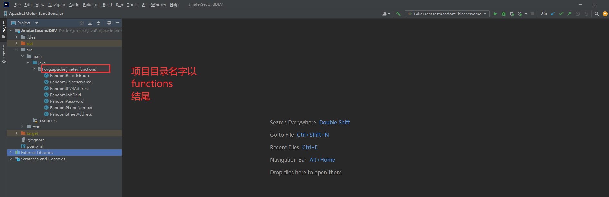

导入jar包到项目中


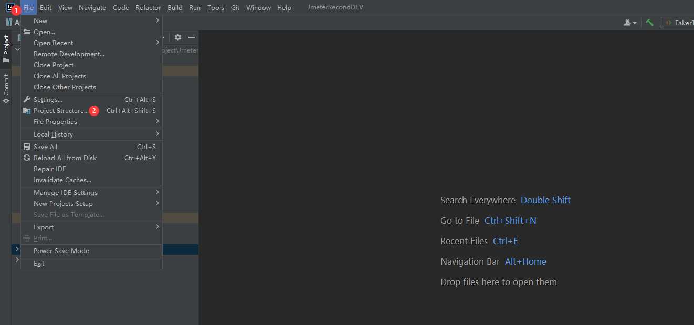


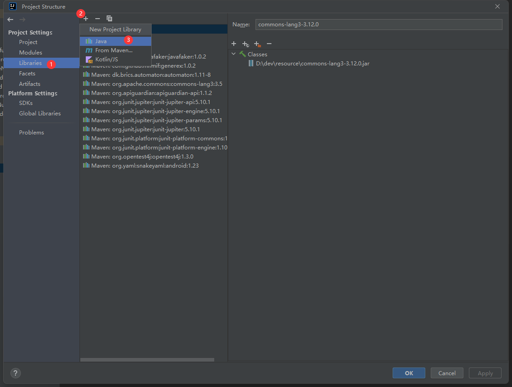

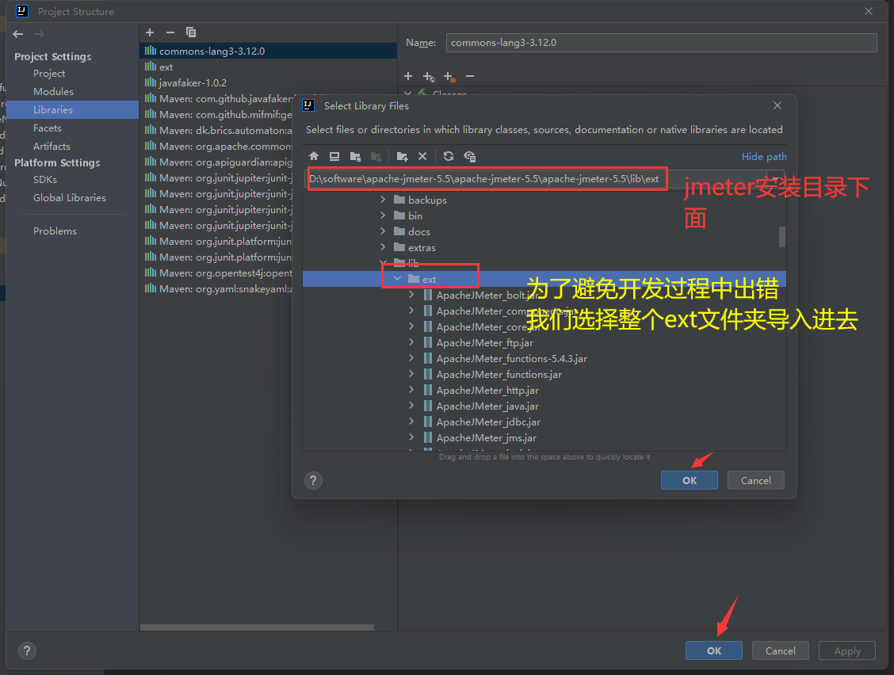

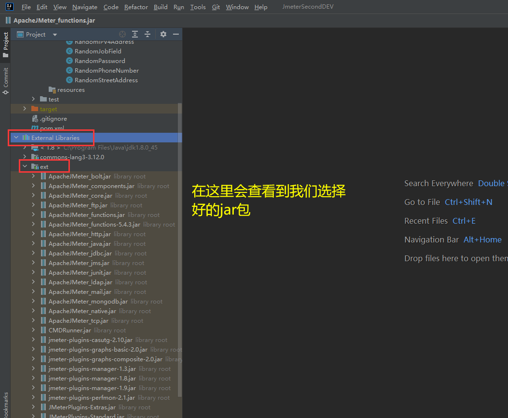


##### 同样的方法将JavaFaker jar包导入到项目中

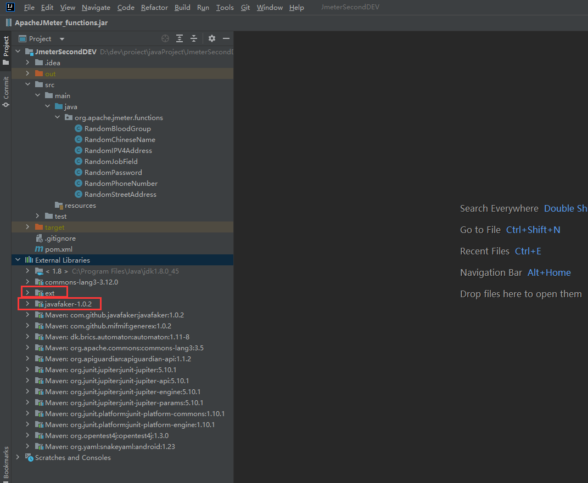

#### Maven工程

maven仓库地址：https://central.sonatype.com/

搜索需要的依赖即可

创建maven项目，在pom.xml中添加Jmeter核心依赖以及JavaFaker依赖

~~~xml
  <dependencies>

    <!--jmeter 核心函数库-->
    <dependency>
      <groupId>org.apache.jmeter</groupId>
      <artifactId>ApacheJMeter_functions</artifactId>
      <version>5.5</version>
    </dependency>

    <!--javafaker-->
    <dependency>
      <groupId>com.github.javafaker</groupId>
      <artifactId>javafaker</artifactId>
      <version>1.0.2</version>
    </dependency>

  </dependencies>
~~~

### 创建需要自定义的函数类，继承AbstractFunction

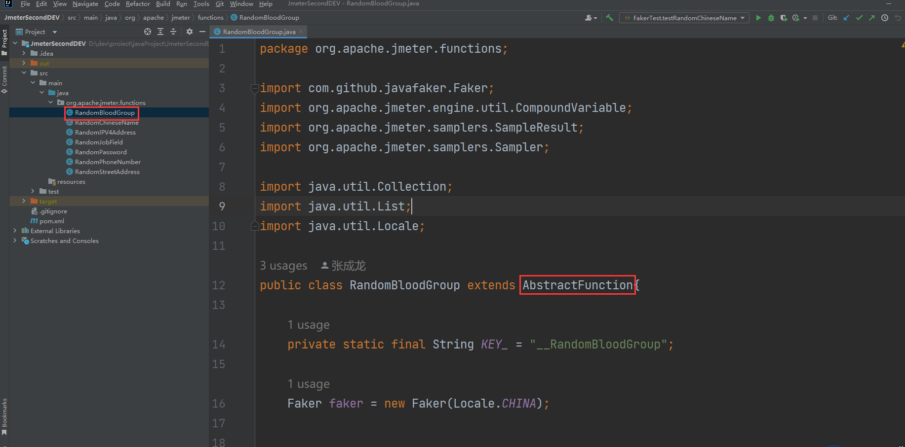

具体代码如下：

~~~~java
package org.apache.jmeter.functions;

import org.apache.jmeter.engine.util.CompoundVariable;
import org.apache.jmeter.samplers.SampleResult;
import org.apache.jmeter.samplers.Sampler;

import java.util.Collection;
import java.util.List;

public class Test extends AbstractFunction{


    // 这里是执行函数逻辑处理的方法
    @Override
    public String execute(SampleResult sampleResult, Sampler sampler) throws InvalidVariableException {
        return null;
    }

    // 这里是接受函数助手对话框中传递而来的参数
    @Override
    public void setParameters(Collection<CompoundVariable> collection) throws InvalidVariableException {

    }

    // 这里是返回函数自定义的函数名
    @Override
    public String getReferenceKey() {
        return null;
    }

    // 这里是设置函数文本参数传入的注释
    @Override
    public List<String> getArgumentDesc() {
        return null;
    }
}

~~~~


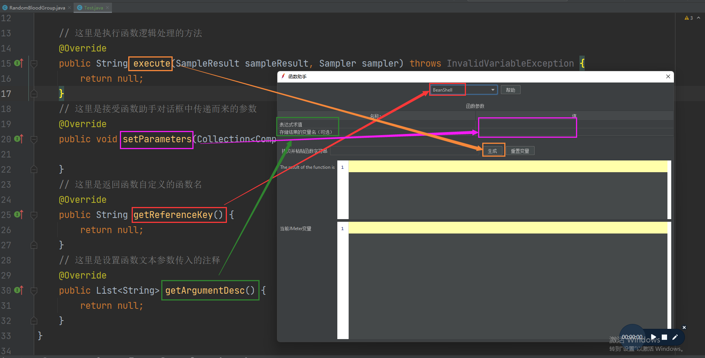


### 以随机生成密码为例子

#### JavaFaker中随机生成密码

在javaFaker中提供了faker.internet().password()方法来随机生成密码

此外，password中可以传递如下四种参数：

- 最小长度
- 最大长度
- 是否包含大小写
- 是否包含特殊字符

代码如下：

~~~~java
import com.github.javafaker.Faker;

import java.util.Locale;

public class FakerTest {

    public static void main(String[] args) {
        Faker faker = new Faker(Locale.CHINA);
        String password = faker.internet().password(1,10,true, true);
        System.out.println(password);
        
    }

}

~~~~

因此，我们可以利于此特性，然后将上述条件作为参数传递进入到jemter函数中去，然后生成想要的密码

#### Jmeter二次开发自定义函数之随机生成密码

全部代码如下：

~~~~java
package org.apache.jmeter.functions;

import com.github.javafaker.Faker;
import org.apache.jmeter.engine.util.CompoundVariable;
import org.apache.jmeter.samplers.SampleResult;
import org.apache.jmeter.samplers.Sampler;

import java.util.Collection;
import java.util.LinkedList;
import java.util.List;
import java.util.Locale;

public class RandomPassword extends AbstractFunction{

    private final static String key="__RandomPassword";
    
    private static String minNumber = "";

    private static String maxNumber = "";

    private static String isTrue = "";

    private static String isFalse = "";

    Faker faker = new Faker(Locale.CHINA);

    @Override
    public List<String> getArgumentDesc() {
        LinkedList<String> list = new LinkedList<>();
        list.add("最小长度(阿拉伯数字) 必填");
        list.add("最大长度(阿拉伯数字) 必填");
        list.add("是否大写(填写为：true/false) 非必填 默认为false");
        list.add("是否包含特殊字符(填写为：true/false) 非必填 默认为false");
        return list;
    }


    @Override
    public void setParameters(Collection<CompoundVariable> collection) throws InvalidVariableException {
        // collection 为 getArgumentDesc 函数接收到的用户输入的值
        checkParameterCount(collection, 4);
        Object[] array = collection.toArray();
        minNumber = ((CompoundVariable)array[0]).execute();
        maxNumber = ((CompoundVariable)array[1]).execute();
        isTrue = ((CompoundVariable)array[2]).execute();
        isFalse = ((CompoundVariable)array[3]).execute();

    }


    @Override
    public String execute(SampleResult sampleResult, Sampler sampler) throws InvalidVariableException {

        String pwd = faker.internet().password(Integer.parseInt(minNumber), Integer.parseInt(maxNumber),
                Boolean.parseBoolean(isTrue), Boolean.parseBoolean(isFalse));
        return pwd;
    }


    @Override
    public String getReferenceKey() {
        return key;
    }


}

~~~~

##### getArgumentDesc

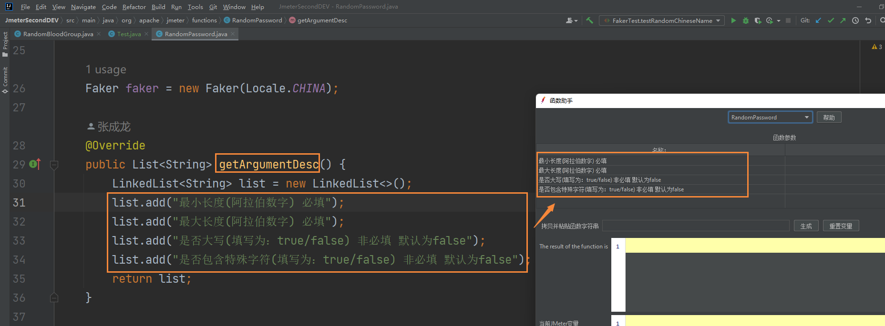

这是Jmeter中用来设置名称的方法，List集合，用来传递名称

通过实例化列表对象，将需要传入的参数进行预设置描述：

- 最小长度(阿拉伯数字) 必填
- 最大长度(阿拉伯数字) 必填
- 是否大写(填写为：true/false) 非必填 默认为false
- 是否包含特殊字符(填写为：true/false) 非必填 默认为false

##### setParameters

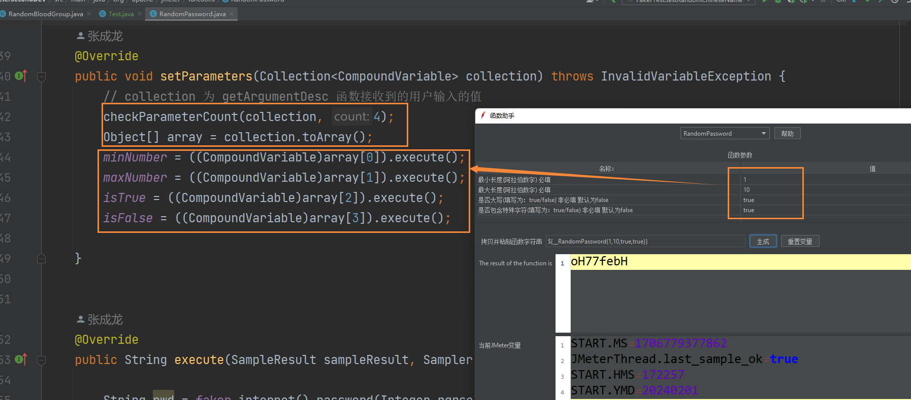


```java
checkParameterCount(collection, 4); //检查用户输入的个数值 固定写法
Object[] array = collection.toArray(); // 转化为数组 固定写法
minNumber = ((CompoundVariable)array[0]).execute(); // 通过Jmeter提供的execute方法，将传递过来的参数值转化为字符串
maxNumber = ((CompoundVariable)array[1]).execute(); // CompoundVariable 是Jmeter提供的用来接受参数的类型，这里强制类型转换
isTrue = ((CompoundVariable)array[2]).execute();
isFalse = ((CompoundVariable)array[3]).execute();
```

在全局设定接受的参数并作初始化操作

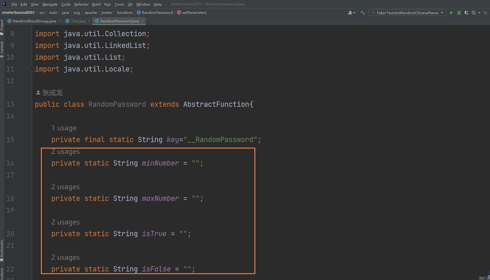

```java
private static String minNumber = ""; // 最小长度

private static String maxNumber = ""; // 最大长度

private static String isTrue = ""; // 是否有大小写

private static String isFalse = ""; // 是否有特殊字符
```

##### getReferenceKey

这里是设置参数名字叫什么的函数，在Jmeter函数助手对话框中选择的函数名称

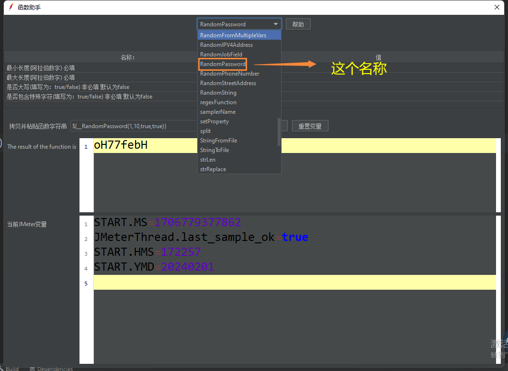


```java
private final static String key="__RandomPassword"; // 这里函数名称需要以两个下划线开头，这是规定
```

##### execute

这里是执行函数逻辑处理的方法

我们知道，我们需要调用Faker中的faker.internet().password()来生成密码

但是我们知道这4个参数的类型分别为：

- 整型
- 整型
- 布尔类型
- 布尔类型

但是我们此时从用户输入接受的参数值类型为字符串类型，因此我们必须做强制类型转换

我们知道8中基本数据类型都有其对应的包装类，包装类底下的方法parse是将字符串转化为对应的类型的方法

因此，我们只需要调用其方法，即可将字符串类型转化为对应的需要类型

首先我们实例化Faker对像

```java
Faker faker = new Faker(Locale.CHINA);// 实例化Faker对象
```

然后进行强制类型转换

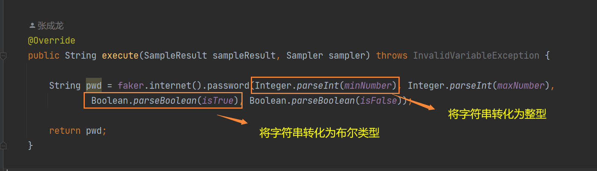


## 打包

将书写好的项目，进行打包


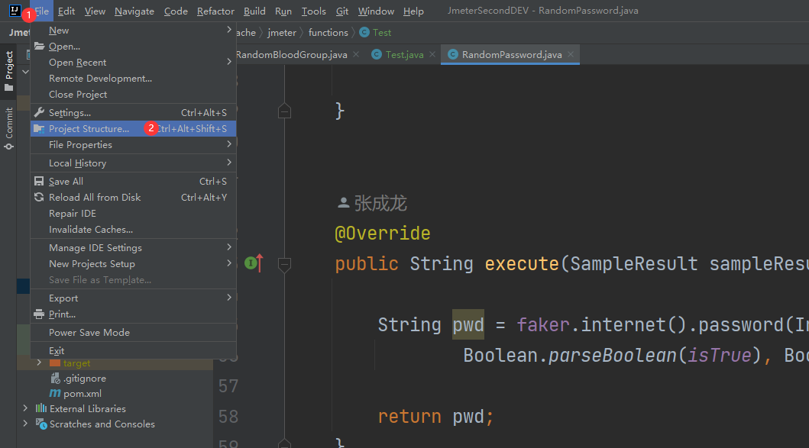

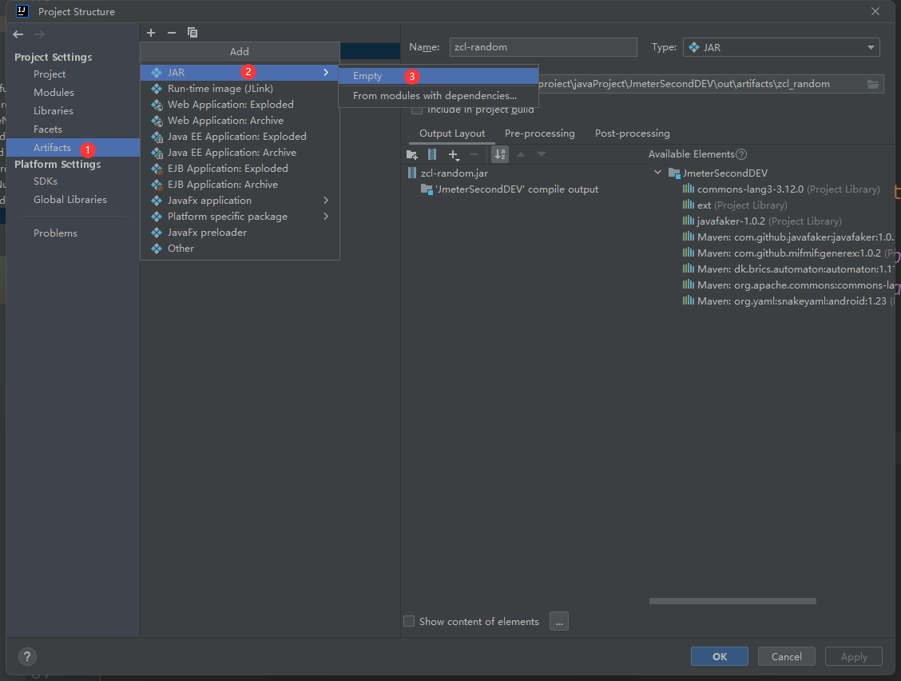

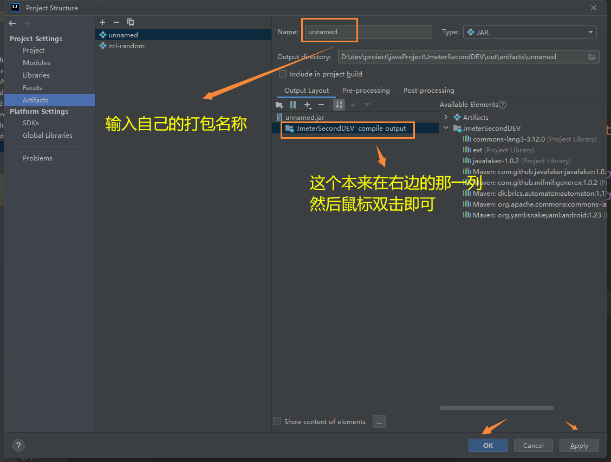

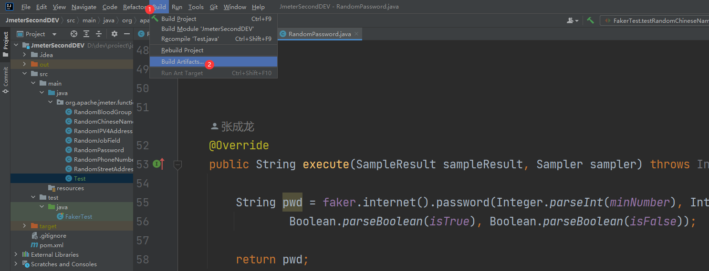

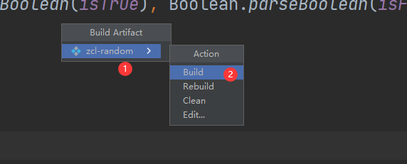

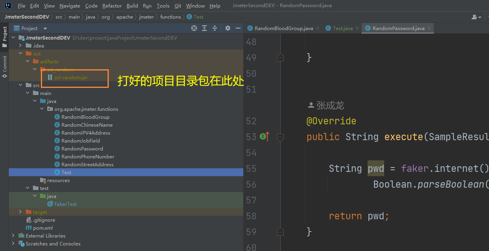

## 复制到Jmeter的安装目录下

然后将其复制到jmeter的安装目录ext下面，重启Jmeter即可


打开Jmeter，打开函数助手对话框，选择刚封装好的函数，填入预先预设参数，点击生成即可


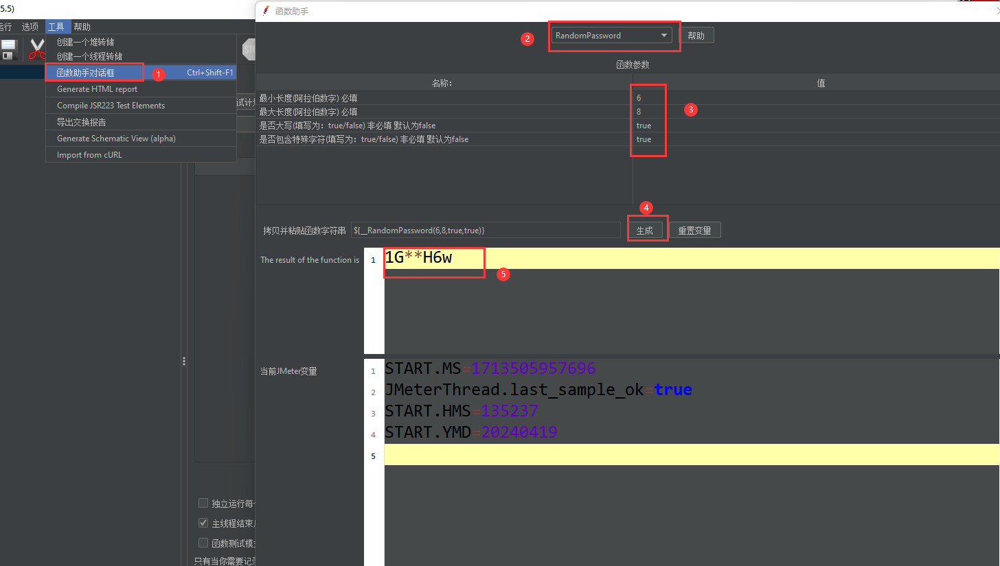


在实际的项目以及单元测试或者接口单独压测过程中，可根据项目需求快速生成接口入参参数，大大提高开发以及测试效率，事半工倍。

